# Hustle 🔥

Conquer your tasks, reclaim your day, and reward yourself with Netflix.

## Key Features
* **Authentication and User Profiles:**
    Register and log in with the option to set a profile image.
    Edit and update your profile information.

* **Social Features:**
    Connect with friends within the app.
    Send and receive friend requests.
    Accept or decline friend requests.

* **Task Management:**
    Create tasks and organize them.
    Add sub-tasks to break down your goals.

* **Time Tracking:**
        Monitor the time spent on tasks.
Enhance productivity with a Pomodoro timer.

* **Habit Tracking:**
    Create and track habits to build positive routines.

* **Progress Visualization:**
    Visualize task and habit progress with daily, weekly, and monthly graphs.

* **Daily Planning:**
    Plan your day efficiently based on different times of the day.

* **Real-time Chat:**
    Chat with friends in real-time.
    Receive push notifications for missed messages.

* **Group Management:**
        Create groups and chat with multiple friends.
Add or remove users from groups.

* **Reward System:**
        Earn "Fire Tokens" for completing tasks.
Algorithmically generate tokens based on task duration.

*  **Features:**
    Use Fire Tokens to unlock premium app features.

* **Subscription Model:**
    Purchase premium access to unlock all features.
    Buy additional Fire Tokens if needed.

* **Friendly Competition:**
    Compete with friends based on productivity metrics.

## Getting Started

Let's begin our exploration of the app by starting with user authentication. We'll review various screenshots of the screens, and I'll provide the technical details related to each screen below it.

### Authentication

| Login              | Register | Create Profile | Create Profile - 2
| :---------------- | :------------------: |:------------------: | -------------------: |
| 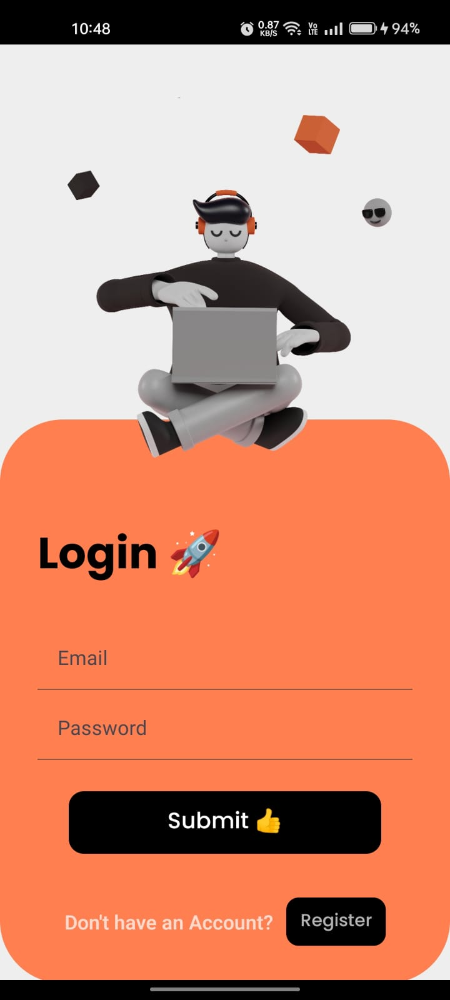     |   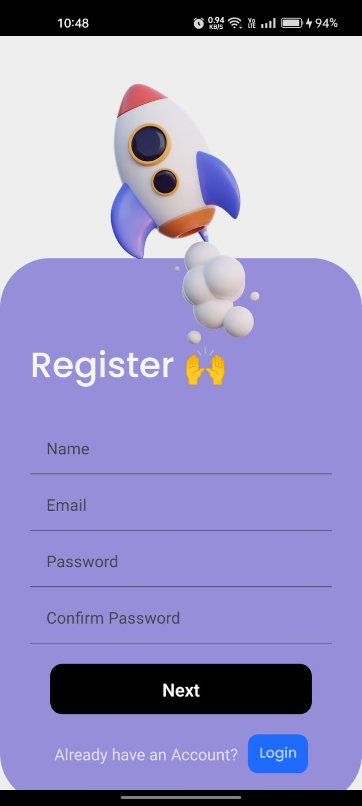    | 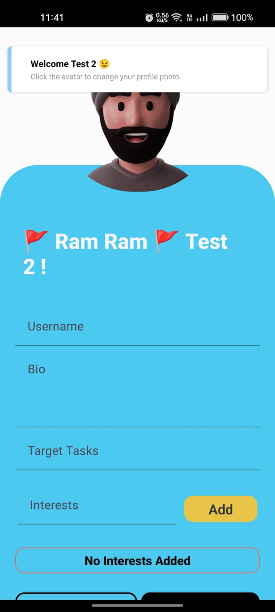  |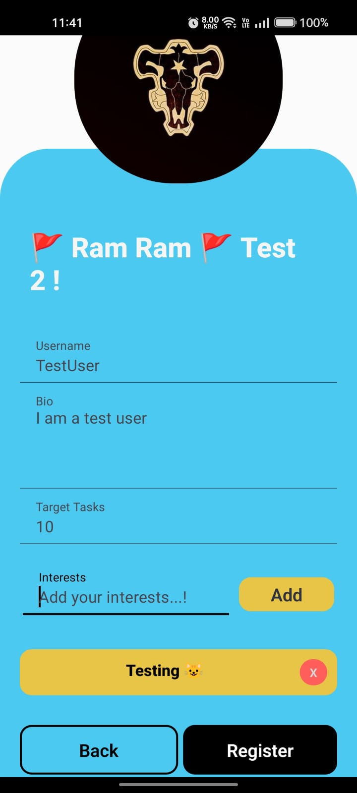  |

### Home Screen

| Home Screen 1 | Home Screen 2 |
| :---------------- | :------------------: |
| 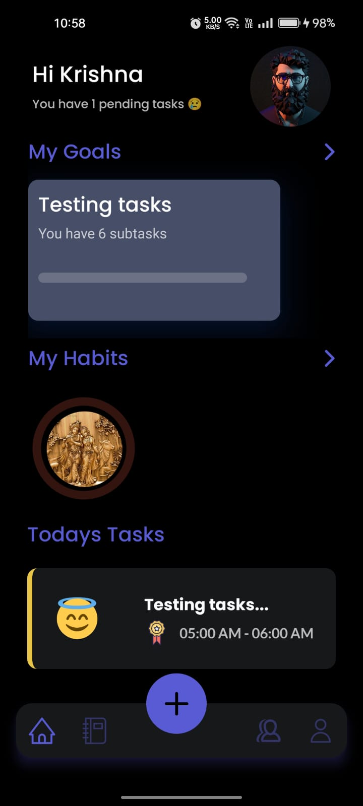     |   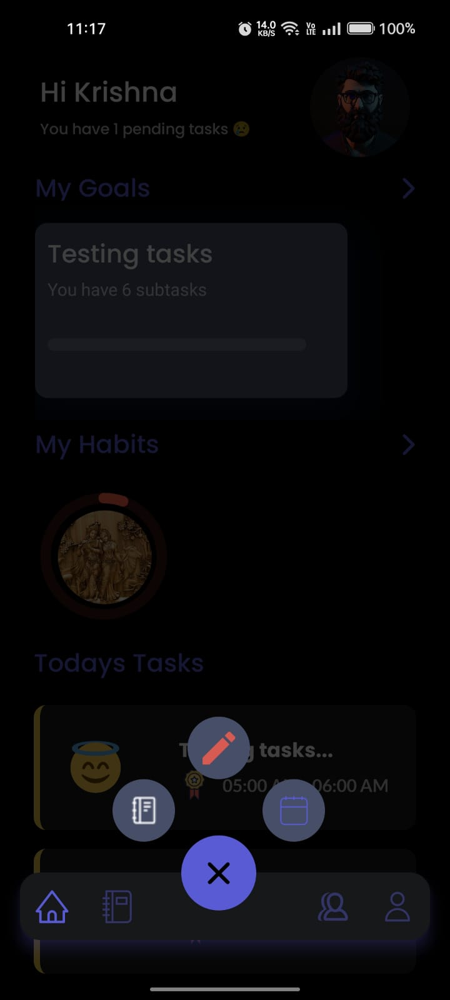    |

* The Home Screen contains 3 sections
   * The first section displays recently completed tasks along with their progress percentages in a progress bar.
   * The second section lists habits sorted by time. For instance, if you've added a habit for 9 AM, the app will prioritize showing upcoming habits followed by others.
   * The third section features tasks scheduled for the day, arranged by their designated times, as explained earlier.
     
 
### User Profile

| User Profile | Edit Profile |
| :---------------- | :------------------: |
| 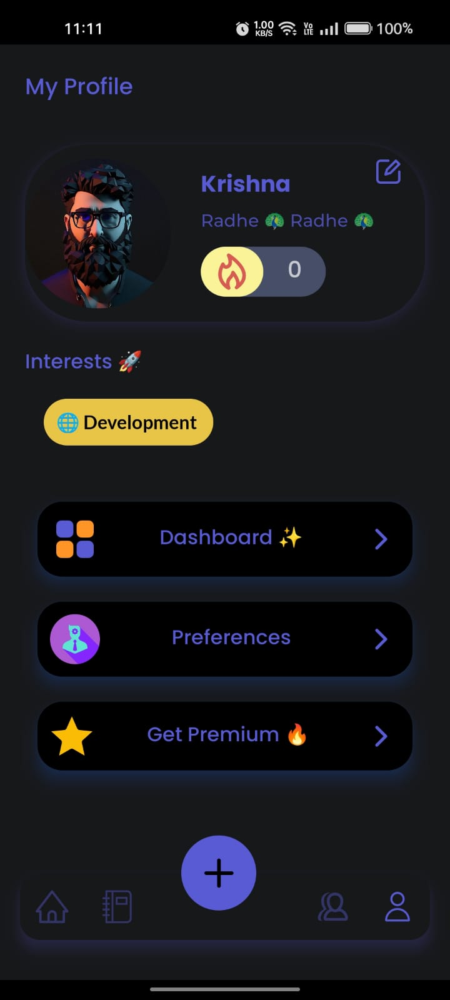     |   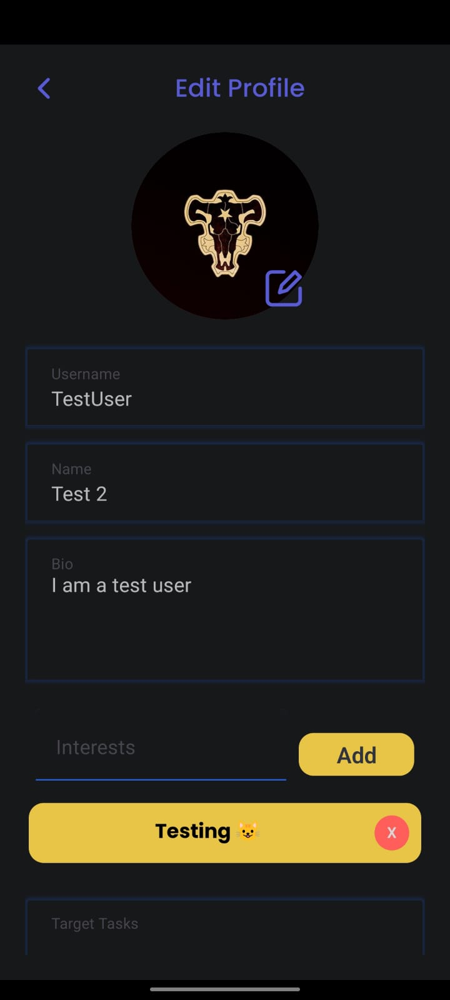    |

### Create & Edit Tasks

| Create Task 1 | Create Task 2 | Edit Task
| :---------------- | :------------------: | -------------------: |
| 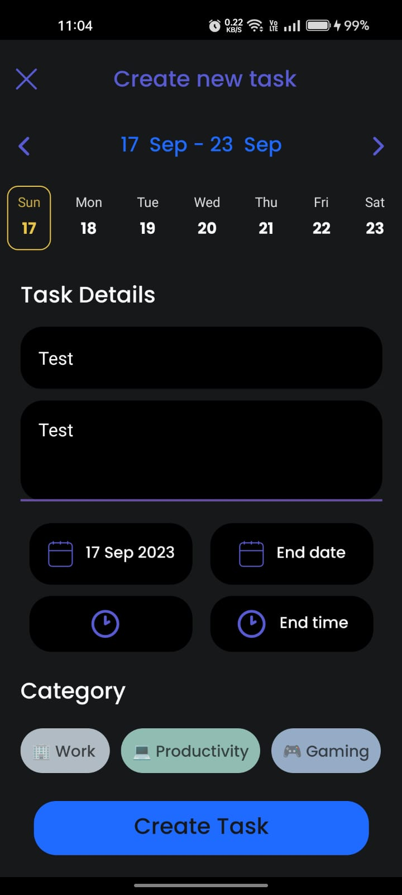     |  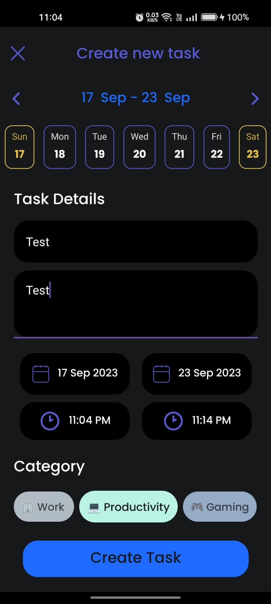     |  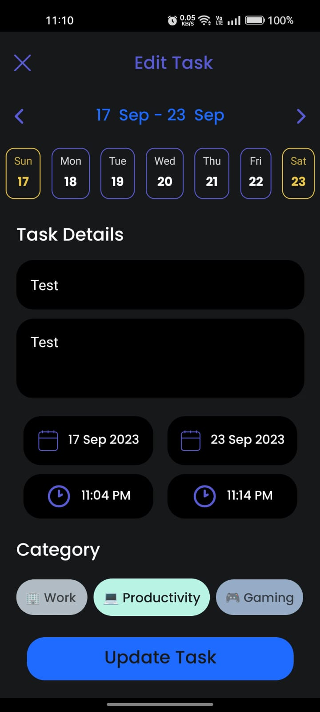    |

### Task Home Page

| Task Home - 1 | Task Home - 2 | Task Home - 3 | Task Home - 4 |
| :---------------- | :------------------: | :------------------: | -------------------: |
| 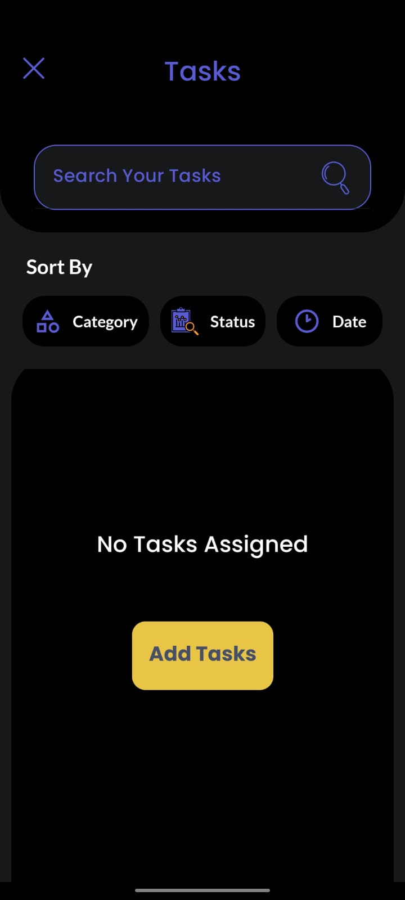     |  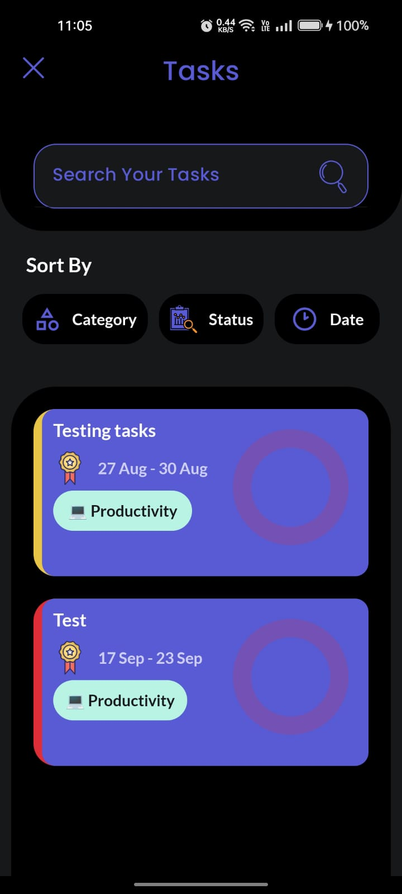     |  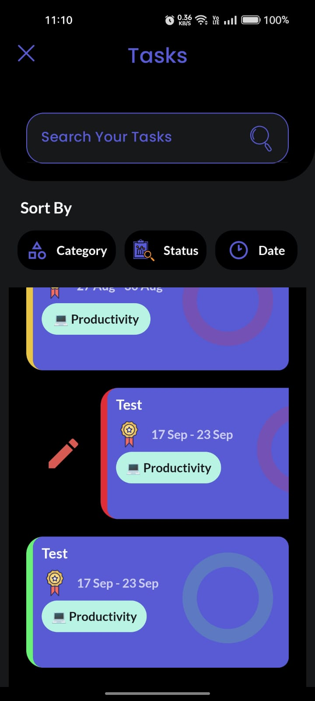    |  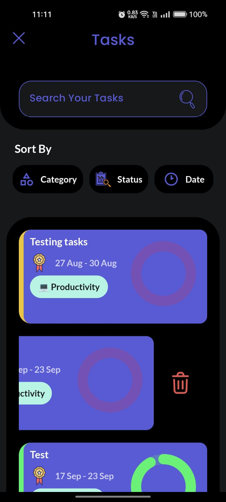    |

* Tasks on the tasks homepage can be sorted based on date, category, and task status.
* When sorting by date, tasks related to today are prioritized, and the default sorting is based on the date.
* Categories are sorted alphabetically.
* When sorting based on task status, working and pending tasks are listed first, followed by expired and completed tasks.

### Main Tasks
| Main Task 1 | Main Task 2 |
| :---------------- | :------------------: |
| 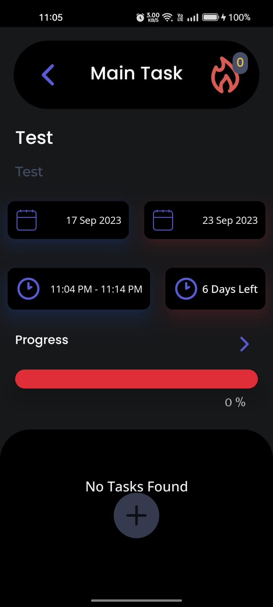     |   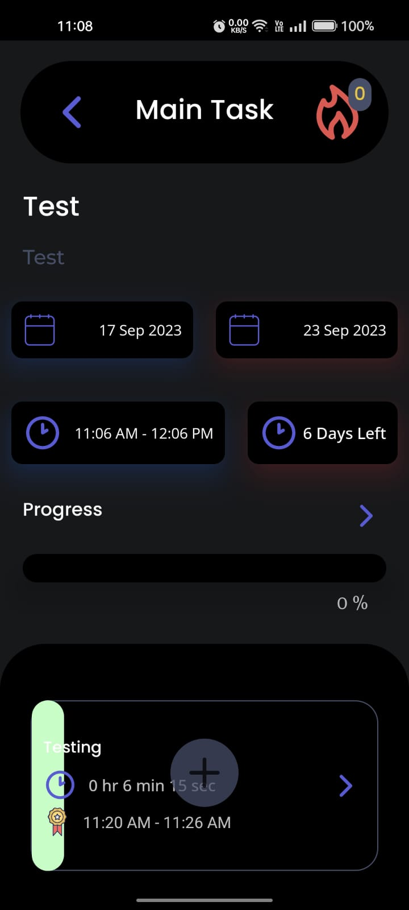    |

* The tasks are referred to as "main tasks," and these main tasks can be further divided into sub-tasks.
* For example, if "Learning JavaScript" is your task, you can break it down into sub-tasks, which may include different concepts like Arrays & Objects, Closures, etc.
* Subtasks can have different start and end times within the main task's start and end times.
* Each Main Task should contain at least one sub-task.
* The progress of the main task is evaluated based on the completion of its sub-tasks.
* Based on the analysis of the task's start and end times and its progress, you will be rewarded with "Fire Tokens."
* A Fire Token is an in-app currency that can be used to unlock premium features in the app.

### Sub Tasks

| Sub Task - 1 | Timer - 1 | Sub Task - 2 |
| :---------------- | :------------------: | -------------------: |
| 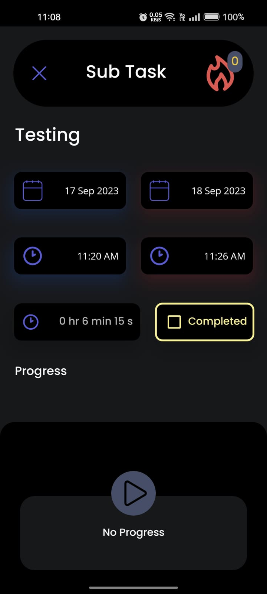     |  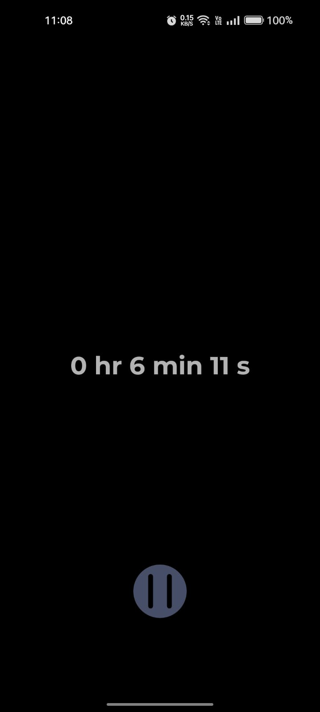     |  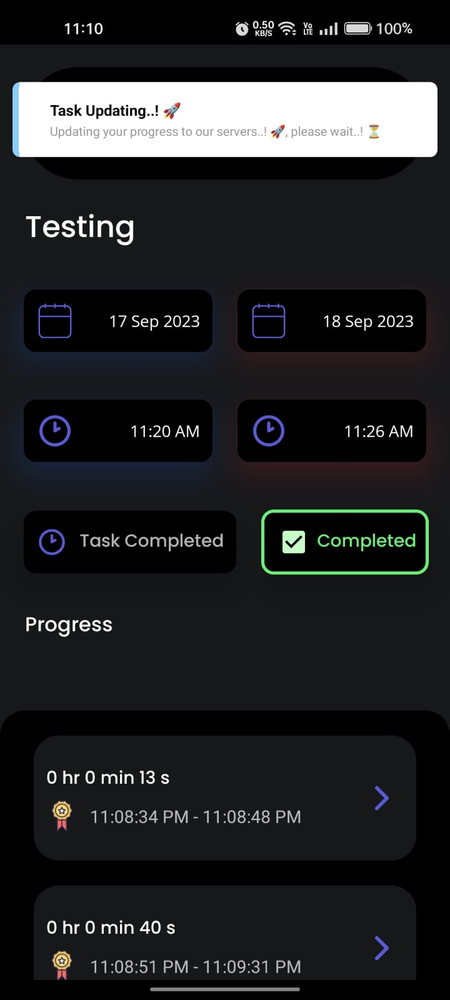    |
