# Hustle 🔥

Conquer your tasks, reclaim your day, and reward yourself with Netflix.

## Key Features
* **Authentication and User Profiles:** 🔒
    Register and log in with the option to set a profile image.
    Edit and update your profile information.

* **Social Features:** 🧑‍🤝‍🧑
    Connect with friends within the app.
    Send and receive friend requests.
    Accept or decline friend requests.

* **Task Management:** 🎯
    Create tasks and organize them.
    Add sub-tasks to break down your goals.

* **Time Tracking:** ⏲️
        Monitor the time spent on tasks.
Enhance productivity with a Pomodoro timer.

* **Habit Tracking:** 🧘
    Create and track habits to build positive routines.

* **Progress Visualization:** 📊
    Visualize task and habit progress with daily, weekly, and monthly graphs.

* **Daily Planning:**
    Plan your day efficiently based on different times of the day.

* **Real-time Chat:** 💬
    Chat with friends in real-time.
    Receive push notifications for missed messages.

* **Group Management:** 
        Create groups and chat with multiple friends.
Add or remove users from groups.

* **Reward System:** ✨
        Earn "Fire Tokens" for completing tasks.
Algorithmically generate tokens based on task duration.

*  **Premium Features:** ⭐
    Use Fire Tokens to unlock premium app features.

* **Subscription Model:** 💳
    Purchase premium access to unlock all features.
    Buy additional Fire Tokens if needed.

* **Friendly Competition:** 📊
    Compete with friends based on productivity metrics.

## Getting Started

Let's begin our exploration of the app by starting with user authentication. We'll review various screenshots of the screens, and I'll provide the technical details related to each screen below it.

### Authentication

| Login              | Register | Create Profile | Create Profile - 2
| :---------------- | :------------------: |:------------------: | -------------------: |
|      |       |   |  |

### Home Screen

| Home Screen 1 | Home Screen 2 |
| :---------------- | :------------------: |
|      |       |

* The Home Screen contains 3 sections
   * The first section displays recently completed tasks along with their progress percentages in a progress bar.
   * The second section lists habits sorted by time. For instance, if you've added a habit for 9 AM, the app will prioritize showing upcoming habits followed by others.
   * The third section features tasks scheduled for the day, arranged by their designated times, as explained earlier.
     
 
### User Profile

| User Profile | Edit Profile |
| :---------------- | :------------------: |
|      |       |

### Create & Edit Tasks

| Create Task 1 | Create Task 2 | Edit Task
| :---------------- | :------------------: | -------------------: |
|      |       |      |

### Task Home Page

| Task Home - 1 | Task Home - 2 | Task Home - 3 | Task Home - 4 |
| :---------------- | :------------------: | :------------------: | -------------------: |
|      |       |      |      |

* Tasks on the tasks homepage can be sorted based on date, category, and task status.
* When sorting by date, tasks related to today are prioritized, and the default sorting is based on the date.
* Categories are sorted alphabetically.
* When sorting based on task status, working and pending tasks are listed first, followed by expired and completed tasks.

### Main Tasks
| Main Task 1 | Main Task 2 | Create Sub Task |
| :---------------- | :------------------: | :------------------: |
|      |       |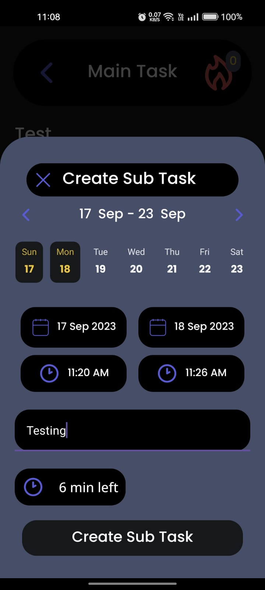    |

* The tasks are referred to as "main tasks," and these main tasks can be further divided into sub-tasks.
* For example, if "Learning JavaScript" is your task, you can break it down into sub-tasks, which may include different concepts like Arrays & Objects, Closures, etc.
* Subtasks can have different start and end times within the main task's start and end times.
* Each Main Task should contain at least one sub-task.
* The progress of the main task is evaluated based on the completion of its sub-tasks.
* Based on the analysis of the task's start and end times and its progress, you will be rewarded with "Fire Tokens."🔥
* A Fire Token is an in-app currency that can be used to unlock premium features in the app.

### Sub Tasks

| Sub Task - 1 | Timer - 1 | Task Notification | Sub Task -2 |
| :---------------- | :------------------: |:------------------: | -------------------: |
|      |       |  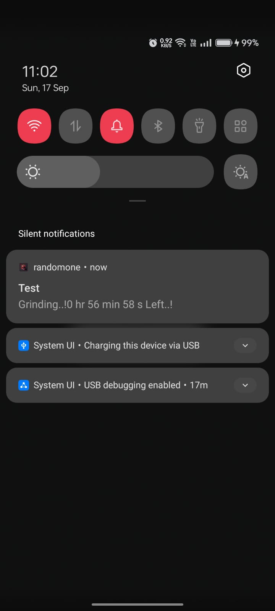    |     |

* The Timer can run in both foreground and background states and a notification containing the timer is sent to the device.
* The progress of the sub-tasks is stored every time you leave the screen, this helps you to start again from where you left.

### Habits

| Create Habit - 1 | Create Habit - 2 | Create Habit - 3 |
| :---------------- | :------------------: | :------------------: |
| 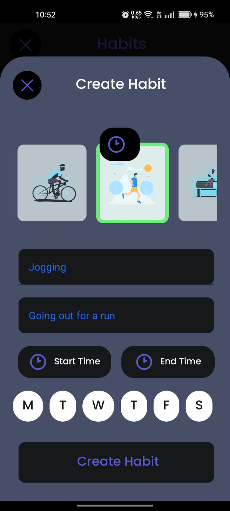     |   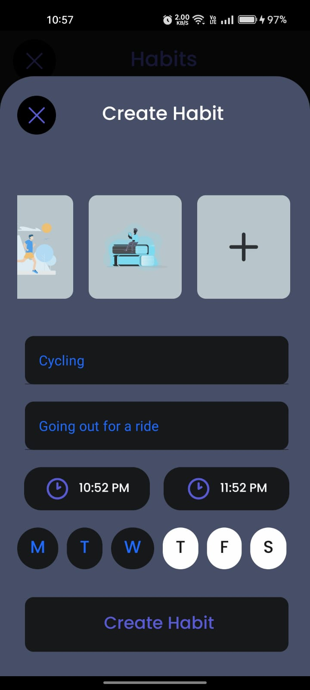    |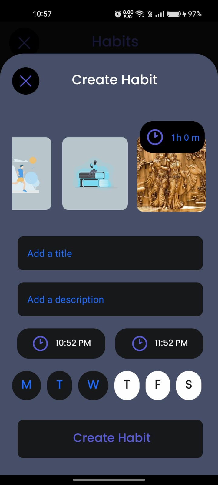    |

* To Create a habit, either you can choose from the default options provided or you can come up with your own habit details such as habit icon, habit name and description.
* You can select the weekdays on which you are planning to work on, the default is Monday to Friday ( People work on Saturdays too though 😢)
* You can adjust the timing for the habit and there you go...!🎉 your habit gets created as soon as you hit that create habit button.

| Habits Home - 1 | Habits Home - 2 | Habits Home - 3 | Timer -2 |
| :---------------- | :------------------: | :------------------: |:------------------: |
| 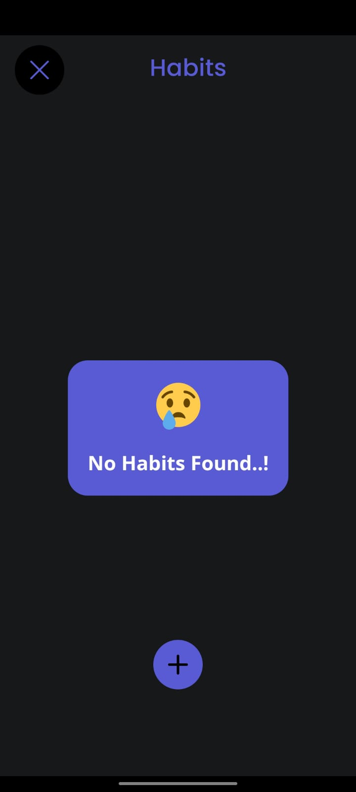     |   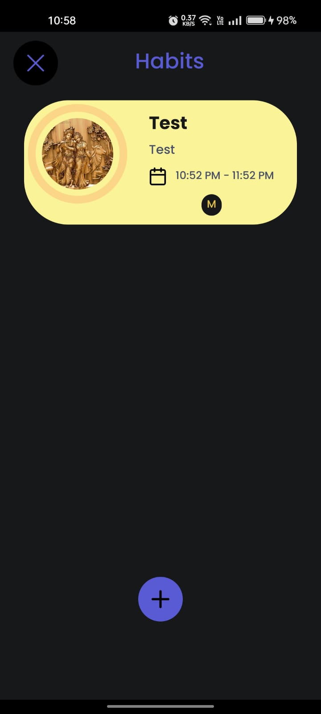    |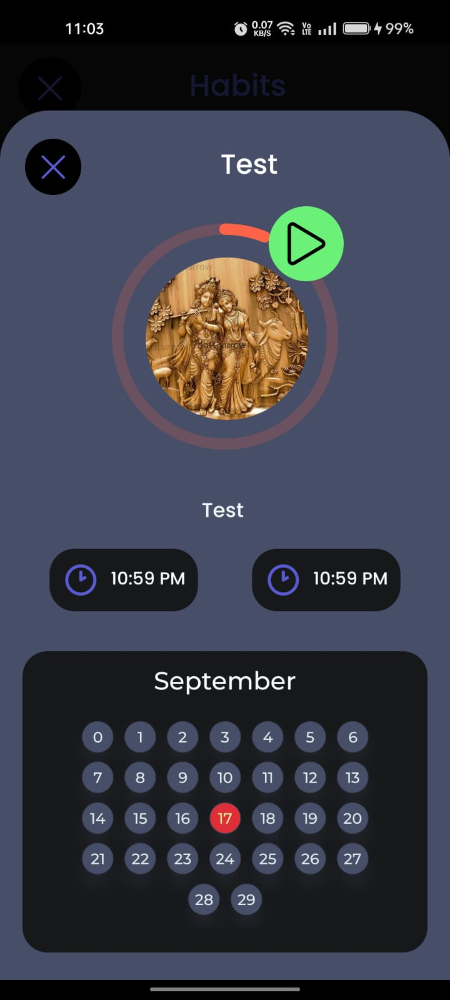    |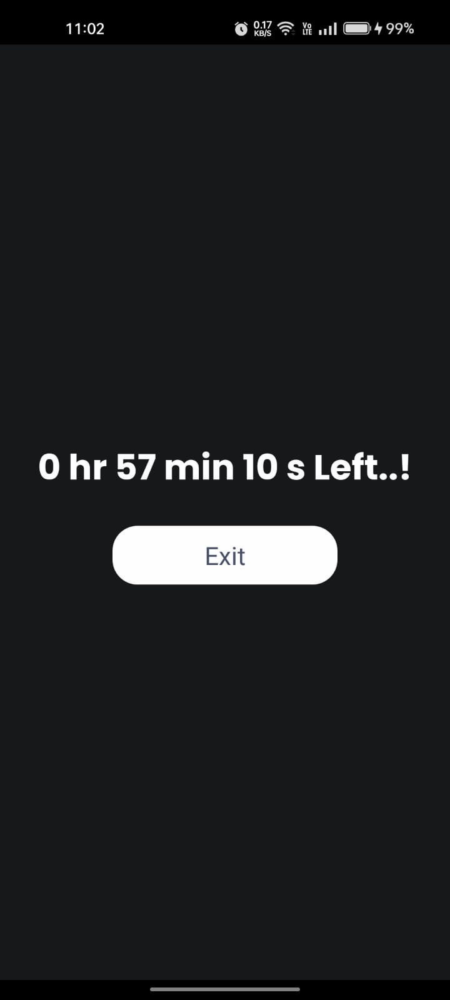    |

* The timer here runs in the background as well and you can analyze your progress of the habit using the calendar view below the habit description as shown in the habit home - 3 screen. ( although you have a detailed dashboard screen for visualizing the progress of individual habits and tasks 😅 ).

### Dashboard
 
| Dashboard - 1 | Dashboard - 2 | Dashboard - 3 |
| :---------------- | :------------------: | :------------------: |
| 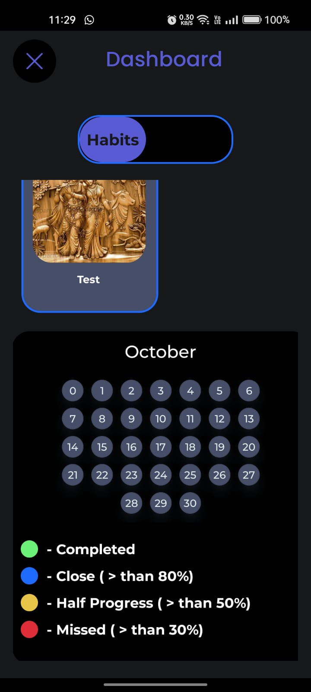     |   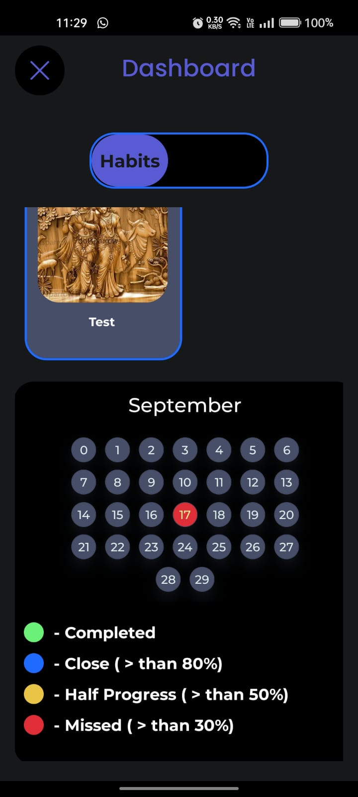    |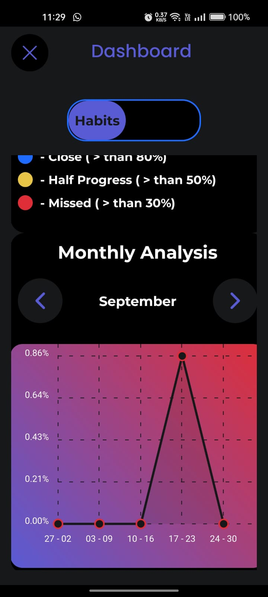    |

* I guess the dashboard screen is self-explanatory 😅.

### Plan Your Day

| Plan Your Day | UI Demo |
| :---------------- | :------------------: |
| 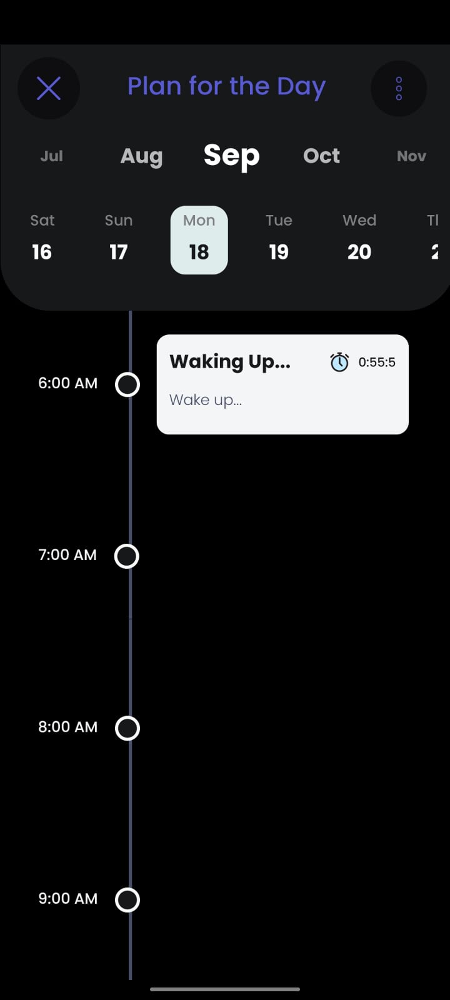     |   <video src="https://github.com/KrishnaChaitanya45/Hustle-Frontend/assets/96629150/784dfd2a-6ba6-4bb4-bb6d-7386f39dfd76" width="300" height="600" />    |

### Chit Chat

* In this app, you can connect with different people, send and accept friend requests, and communicate with your friends using the real-time chat feature.
* If you happen to miss a message from your friend, don't worry—you'll receive a notification for the message. (Even if your friend, with a broken sense of humor, irritates you by sending memes that make no sense but somehow you find them funny. It happens 😅...)
* You can also create a group of friends and have a group chat. (Discussing why React Native is so unpredictable.)
* You can also attach a media file for your message ( for now only images are supported..! ).
* User roles are implemented such that only the admin of the group can remove/add or edit the group info. ( for security reasons, avoid having blue cotton candy lobster as your group icon 🦞 ).

#### Chat Home

| Chat Home - 1 | Chat Home - 2 | Chat Home - 3 |  Friend Request |
| :---------------- | :------------------: | :------------------: |:------------------: |
| 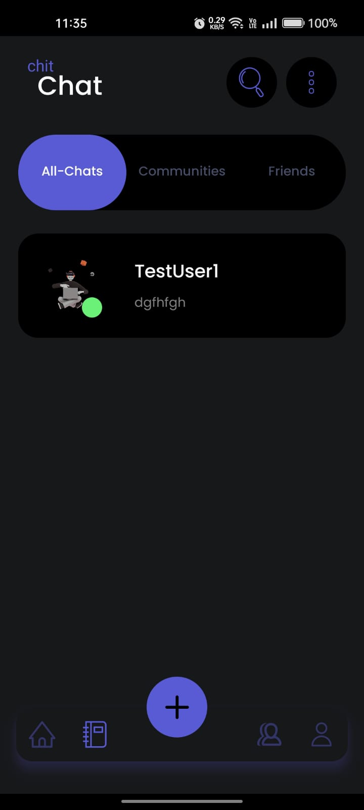     |   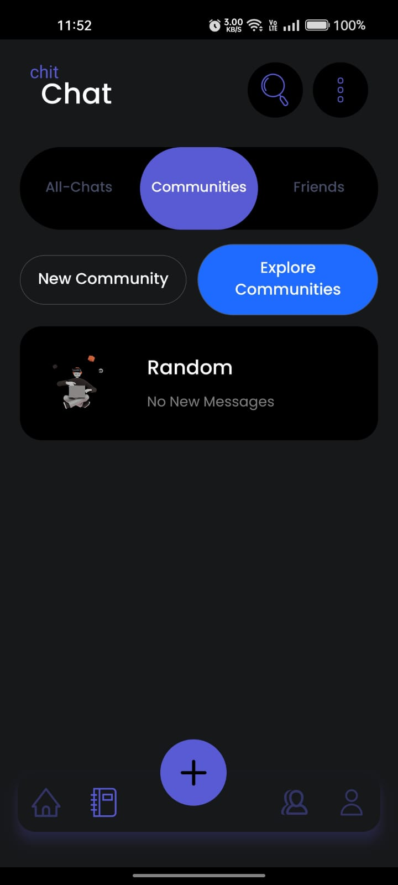    |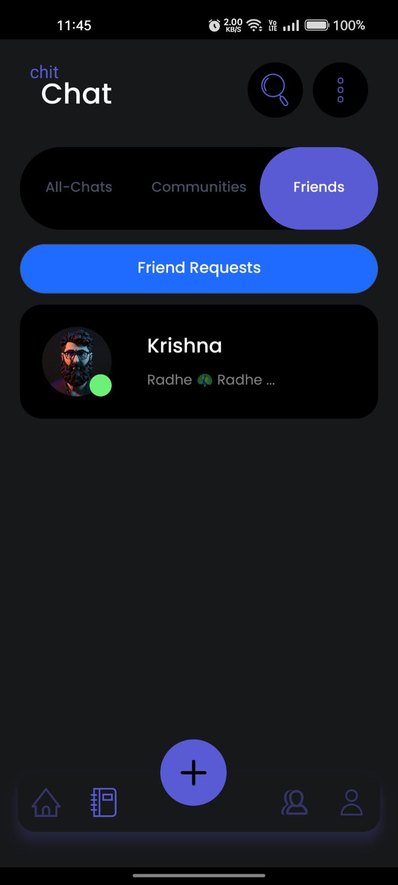    |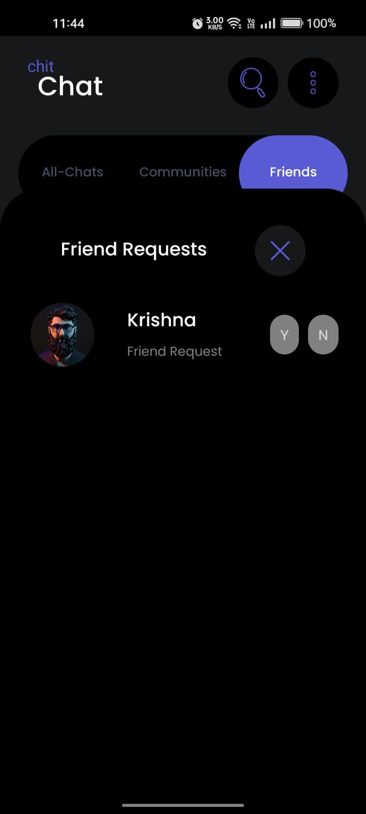    |

#### Create Groups

| Search User | Create Group - 1 |  Create Group - 2| 
| :---------------- | :------------------: | :------------------: |
|      |   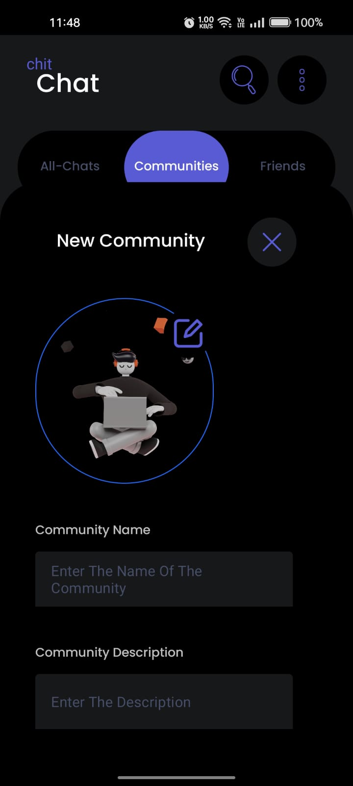    |    |

| View Group Info  |  Edit Group - 1 | Edit Group - 2 |   
| :---------------- | :------------------: |:------------------: |
|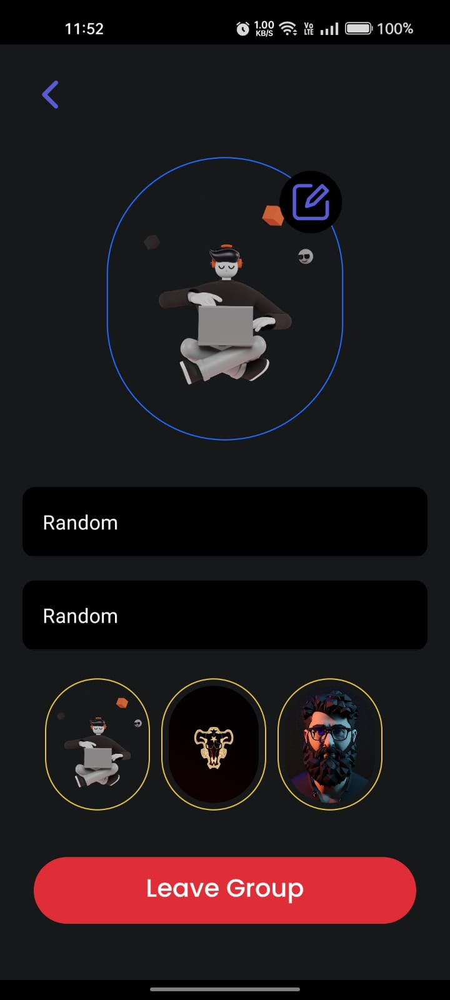     |       |       |

#### Chat Screens

| Chat -  1 | Chat - 2 | Chat - 3 |  
| :---------------- | :------------------: |:------------------: |
|       |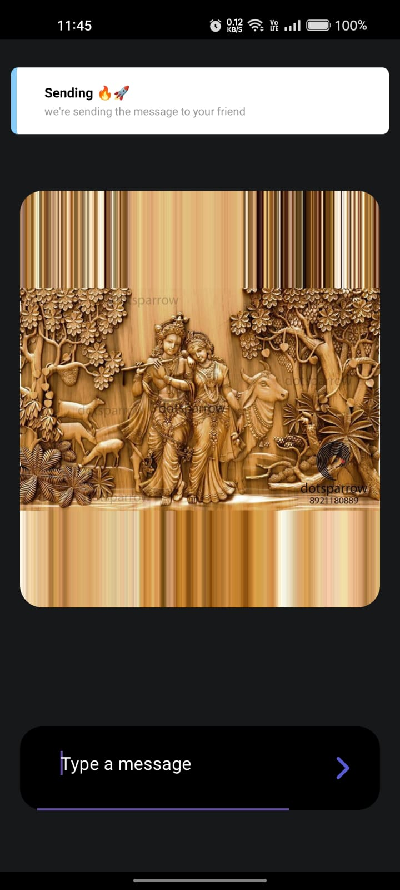    |     |

### Additional Screens

| Splash | Fire Tokens | Loading - 1 | Loading - 2 |
| :---------------- | :------------------: | :------------------: | :------------------: |
|      |   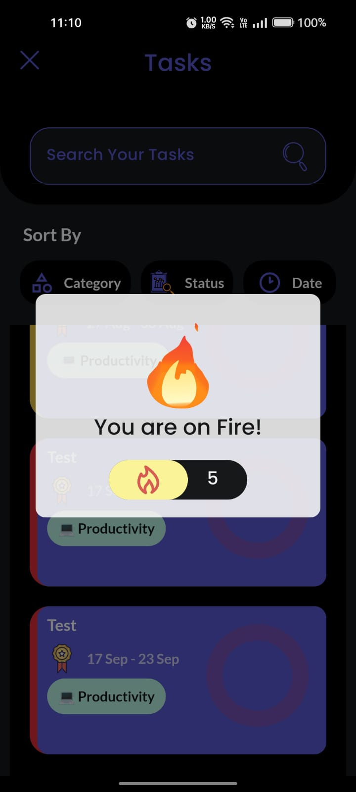    | 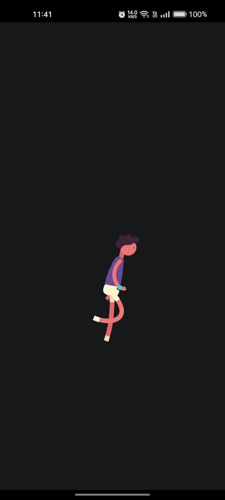    | 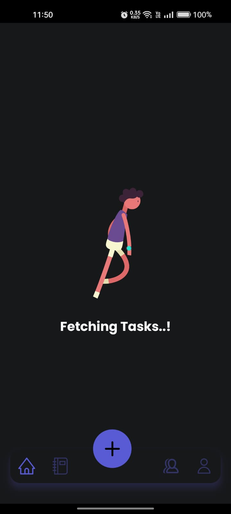    |

* Cron jobs are executed on the backend, and they are used to send push notifications.
* These push notifications are sent from the server to remind you to work on your tasks or habits.
* Depending on your selected weekdays and timings, you'll receive three notifications for a particular task or habit:
    * One notification one hour before the task starts.
    * Another notification 30 minutes before the task starts.
    * A final notification at the task's start time.
* I have utilized Firebase for handling push notifications.

#### Tech Stacks

React Native, Firebase, MongoDB, Node JS, Express JS, Cloudinary, Socket.io, Redis.

